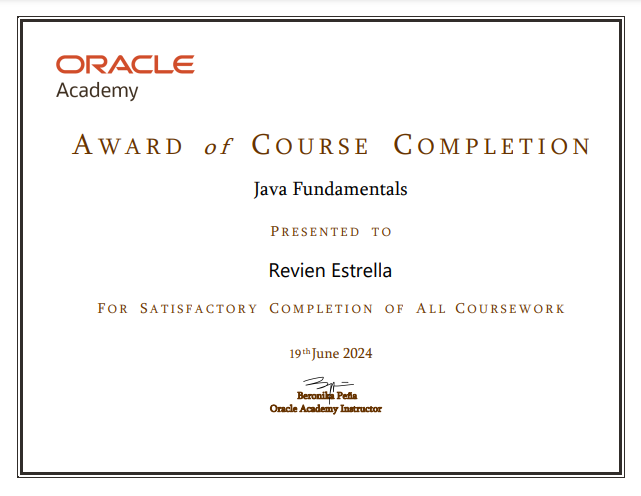

# 👋 Hi, I'm Revien Estrella!

### 💻 Student Developer | Aspiring Software Engineer | Tech Enthusiast

Welcome to my GitHub profile! I'm **Revien**, a student developer passionate about technology, programming, and building projects that turn ideas into practical solutions.

This GitHub profile serves as my **portfolio and development journey**, where I showcase my projects, skills, certificates, and the things I'm currently learning.

---

## 🧑‍💻 About Me

* 🎓 Student developer continuously improving my programming skills
* 💻 Building academic and personal projects
* 🌱 Currently expanding my knowledge in software development
* 🤖 Exploring Artificial Intelligence and emerging technologies
* ☕ Learning, coding, debugging, and improving every day
* 🧠 Interested in problem-solving and creating practical applications
* 🎯 Working toward becoming a professional software developer

---

## 🚀 What I'm Interested In

I enjoy exploring different areas of technology, including:

* 🌐 Web Development
* 💻 Software Development
* ☕ Java Development
* 🗄️ Database Systems
* 📦 Inventory & Management Systems
* 🤖 Artificial Intelligence
* 📊 Data Management
* 🔧 Git & GitHub

---

# 📂 Featured Projects

## 📦 Inventory Management System

A project focused on improving the way inventory is recorded, monitored, and managed.

### Features

* 📋 Product management
* 📦 Inventory tracking
* 🔍 Stock monitoring
* 🧾 Sales and inventory records
* ⚠️ Inventory discrepancy tracking
* 📊 Organized inventory information

> The goal of this project is to provide a more organized and efficient approach to inventory management.

---

## 💡 More Projects

I'm continuously working on new academic and personal projects as I develop my skills.

You can explore my repositories below to see my projects, experiments, and progress.

<p align="center">
  🚀 <strong>More projects coming soon!</strong> 🚀
</p>

---

# 🖼️ Project Showcase

Here are some screenshots and examples of my work:

<p align="center">
  
  
</p>

---

# 🏆 Certificates & Achievements

I'm continuously learning and improving my skills through courses, projects, and certifications.

## 🤖 Artificial Intelligence Certificate

<p align="center">
  
</p>

---

## ☕ Java Certificate

<p align="center">
  
</p>

---

# 🛠️ Skills & Technologies

### 💻 Development

<p align="center">
  
</p>

### 🔧 Tools

* 🐙 GitHub
* 🔀 Git
* 💻 Visual Studio Code
* ☕ Java
* 🗄️ MySQL
* 🌐 HTML / CSS / JavaScript

---

# 📚 Currently Learning

I'm continuously working on improving my technical skills.

```text
Programming
Software Development
Web Development
Database Management
Artificial Intelligence
Git & GitHub
Problem Solving
```

---

# 🎯 My Goals

* 🚀 Build more real-world applications
* ☕ Improve my Java development skills
* 🌐 Become better at web development
* 🤖 Explore Artificial Intelligence
* 🗄️ Learn more about databases and backend development
* 🧠 Improve my problem-solving abilities
* 💼 Build a strong developer portfolio
* 📚 Continue learning new technologies

---

# 📈 My Development Philosophy

I believe that becoming a better developer comes from consistently building and learning.

### **Learn → Build → Test → Debug → Improve → Repeat 🔄**

Every project, whether big or small, is an opportunity to learn something new.

---

# 📫 Let's Connect

Thanks for visiting my GitHub profile! 👋

Feel free to explore my repositories and follow my journey as I continue learning, building, and improving as a developer.

<p align="center">
  <strong>⭐ Learn. Build. Improve. Repeat. ⭐</strong>
</p>

---

<p align="center">
  <i>Thanks for stopping by! 🚀</i>
</p>
