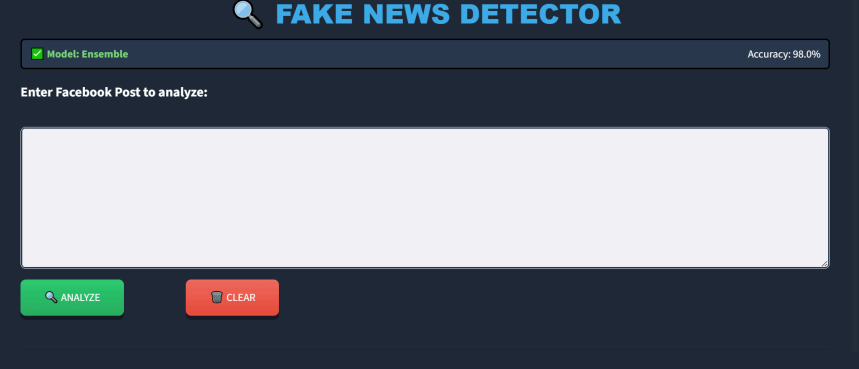
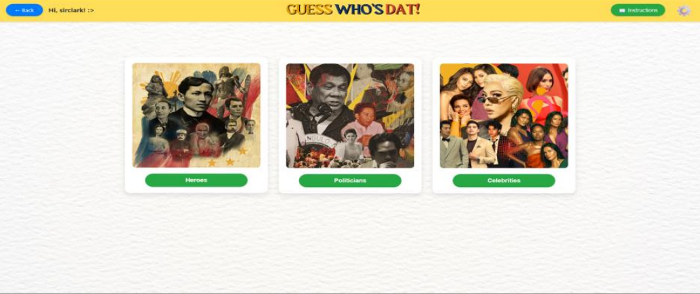

# 👋 Hi, I'm Revien Estrella!

### 💻 Student Developer | Aspiring Software Engineer | Tech Enthusiast

Welcome to my GitHub profile! I'm **Revien**, a student developer who enjoys learning new technologies, building projects, and turning ideas into practical applications.

I use this space to showcase my **projects, experiments, certificates, and development journey** as I continue growing my skills in software development.

---

## 🚀 About Me

* 🎓 Currently studying and developing my skills in technology and software development
* 💻 Building academic, personal, and practical projects
* 🌱 Currently learning new programming concepts and development tools
* 🤖 Interested in Artificial Intelligence and emerging technologies
* 🛠️ I enjoy solving problems through code
* 📚 Always looking for opportunities to learn and improve
* 🎯 Goal: Become a skilled and versatile software developer

---

## 🧑‍💻 What I Do

I enjoy working on projects that allow me to explore different areas of development, including:

* 🌐 Web Development
* 💻 Software Development
* 🗄️ Database Systems
* 📦 Inventory & Management Systems
* 🤖 Artificial Intelligence
* 📊 Data Management
* 🔧 Git & GitHub

---

# 📂 Featured Projects

Here are some of the projects I've worked on or am currently developing.

### 📦 Inventory Management System

A project designed to improve how inventory is recorded, monitored, and managed.

**Features include:**

* 📋 Product management
* 📦 Inventory tracking
* 🔍 Stock monitoring
* 🧾 Sales and inventory records
* ⚠️ Inventory discrepancy tracking
* 📊 Organized inventory information

> This project focuses on creating a more organized and efficient way of managing inventory records.

---

### 💡 More Projects Coming Soon

I'm continuously working on new academic and personal projects.

Check out my repositories to explore my work, experiments, and development progress.

**⬇️ Explore my repositories below!**

---

# 🖼️ My Work

Here are some snapshots of my projects and work:

<p align="center">
  
  
</p>

---

# 🏆 Certificate

### 🤖 Artificial Intelligence Certificate

A certificate representing my learning and exploration in **Artificial Intelligence**.

<p align="center">
  
</p>

---

# 🛠️ Technologies & Tools

### Languages & Development

```text
Programming        █████████████████░░░
Web Development    ███████████████░░░░░
Database           ██████████████░░░░░░
Git & GitHub       █████████████████░░░
AI / Technology    ████████████░░░░░░░░
```

### Tools I Use

* 🐙 GitHub
* 🔧 Git
* 💻 VS Code
* 🗄️ Database Management Tools
* 🌐 Web Development Tools
* 🤖 AI Development Tools

---

# 📈 My Development Journey

I'm still at the beginning of my development journey, but every project gives me an opportunity to learn something new.

My approach is simple:

**Learn → Build → Test → Improve → Repeat 🔄**

I believe that the best way to improve as a developer is through consistent practice and building real projects.

---

# 🎯 Current Goals

* 📚 Improve my programming skills
* 🚀 Build more real-world applications
* 🤖 Explore Artificial Intelligence
* 🌐 Improve my web development skills
* 🗄️ Learn more about databases and backend development
* 🧠 Strengthen my problem-solving skills
* 💼 Build a strong developer portfolio

---

# 📫 Let's Connect

Thanks for visiting my GitHub profile! 👋

Feel free to explore my repositories and follow my journey as I continue learning, building, and improving.

<p align="center">
  <strong>⭐ Learn. Build. Improve. Repeat. ⭐</strong>
</p>

---

<p align="center">
  <i>Thanks for stopping by! 🚀</i>
</p>
